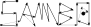

[](https://sambo-optimization.github.io/)
=====
[](https://github.com/sambo-optimization/sambo/actions)
[](https://pypi.org/project/sambo)
[](https://pypi.org/project/sambo)
[](https://github.com/sponsors/kernc)

SAMBO: Sequential And Model-Based (Bayesian) Optimization of black-box objective functions.

[**Project website**](https://sambo-optimization.github.io)

[Documentation]

[Documentation]: https://sambo-optimization.github.io/doc/sambo/


Installation
------------
```shell
$ pip install sambo
# or
$ pip install 'sambo[all]'   # Pulls in Matplotlib, scikit-learn
```


Usage
-----
See [examples on project website](https://sambo-optimization.github.io/#examples).


Features
--------
* Python 3+
* Simple usage, standard API.
* Algorithms prioritize to minimize number of evaluations of the objective function: SHGO, SCE-UA and SMBO available.
* Minimal dependencies: NumPy, SciPy (scikit-learn & Matplotlib optional).
* State-of-the-art performance—see [benchmark results](https://sambo-optimization.github.io/#benchmark)
  against other common optimizer implementations.
* Integral, real (floating), and categorical dimensions.
* Fast approximate global black-box optimization.
* [Beautiful Matplotlib charts](https://sambo-optimization.github.io/#examples).


Development
-----------
Check [CONTRIBUTING.md](CONTRIBUTING.md) for hacking details.
